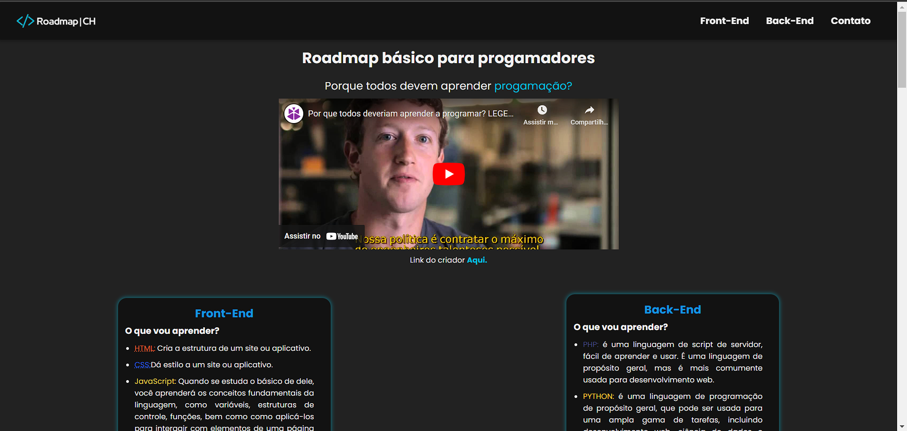

# 🚀 Roadmap do Programador Iniciante 🌱

Bem-vindo ao Roadmap do Programador Iniciante! Este site foi desenvolvido para fornecer orientações e recursos para quem está começando a jornada na programação, abrangendo HTML, CSS, JavaScript, PHP e Python.

## 📋 Visão Geral

O Roadmap do Programador Iniciante é um guia passo a passo para ajudá-lo a aprender as habilidades necessárias para se tornar um programador proficientes em várias tecnologias populares da web.

## 🛠️ Tecnologias Cobertas

- HTML
- CSS
- JavaScript
- PHP
- Python

## 🖥️ Demonstração

### 📷 Imagem do Site

### 🎥 Vídeo de Demonstração

https://github.com/CodeClayton/Roadmap-Progamacao/assets/134659710/9b7bfdc5-99fd-4a9f-b305-df6f2f77ea37

## 🔗 Acesse o Site

Para acessar o Roadmap do Programador Iniciante, visite [nosso site](https://codeclayton.github.io/Roadmap-Progamacao/index.html).

Esperamos que este recurso seja útil em sua jornada de aprendizado!

---

Desenvolvido por [Code Clayton](https://github.com/CodeClayton) 🌟
